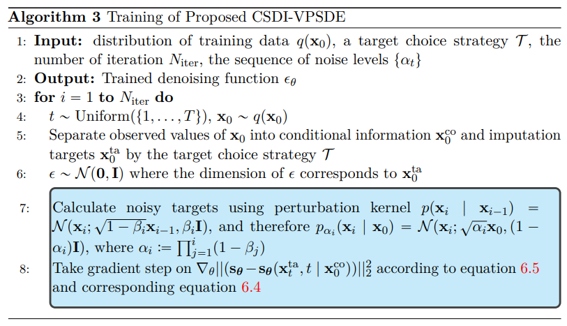
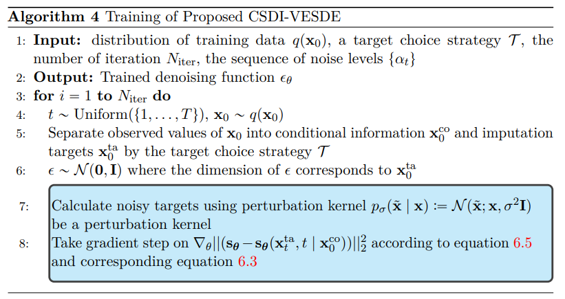
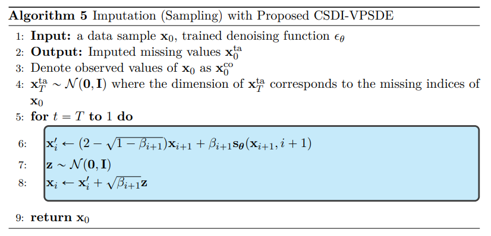
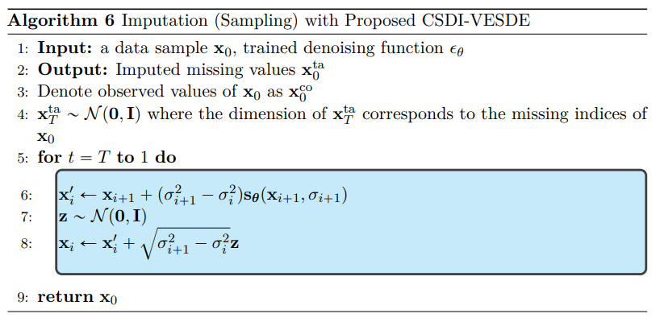

# Score-Based Stochastic Differential Equations Algorithms for Irregular Time Series
This is the github repository for the Score Based Variance Preserving SDE and Variance Exploding SDE algorithms within the 
CSDI framework implementation of the thesis Score Matching for Irregularly Sampled Time Series.








## Requirement

Please install the packages in requirements.txt

## Preparation
### Download the healthcare dataset 
```shell
python download.py physio
```
### Download the air quality dataset 
```shell
python download.py pm25
```

## Experiments 

### training and imputation for the healthcare dataset
```shell
python exe_physio.py --testmissingratio [missing ratio] --nsample [number of samples]
```

### imputation for the healthcare dataset with pretrained model
```shell
python exe_physio.py --modelfolder pretrained --testmissingratio [missing ratio] --nsample [number of samples]
```

### training and imputation for the healthcare dataset
```shell
python exe_pm25.py --nsample [number of samples]
```

### Visualize results
'visualize_examples.ipynb' is a notebook for visualizing results.

## Acknowledgements

This code builds on [CSDI](https://github.com/ermongroup/CSDI), [ScoreSDE](https://github.com/yang-song/score_sde) and [DiffWave](https://github.com/lmnt-com/diffwave)

